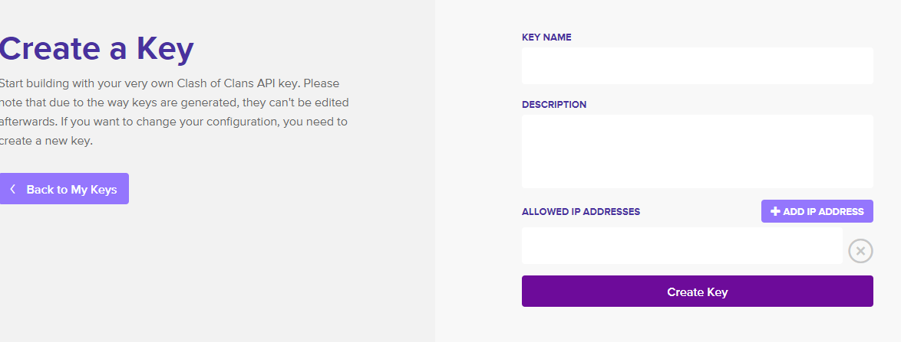

# clash-client
The Clash-Client .NET Framework library simplifies integration with the Clash of Clans API provided by SuperCell.  It exposes `IApiClient` and `ApiClient` types that handle serialization and deserialization while consuming the available REST endpoints.

## Getting Started

### NuGet

To install and use the library in your project, run the following NuGet command:
> Install-Package ClashClient

You can optionally specify a version using the `-Version x.*` flag.

### Code Integration

To use the library, first you'll need to create a developer account with SuperCell at: https://developer.clashofclans.com

Once you have an account, set up a key:


#### Configuration

The clash-client library has extensibility in mind to suit needs for multiple configurations.  The `ClashClient.Common.Configuration.IConfigurationProvider` can be implemented to look at a `Web.config` or similar configuration file, a SQL database, or some other source by implementing it in your code.
Provided with the library is the `ClashClient.Configuration.InMemoryConfigurationProvider` that can be used.

Depending on how you set your configuration, the following keys are required for the library to function:

|Key|Value|Description
|--|--|--|
|ApiVersion|`v1`|The version of the clash of clans API to use (currently v1)
|ClashAPI|`https://api.clashofclans.com'|The base URL for the API
|ApiToken|\{your-token-here\}|The token you created on your Clash of Clans developer account

> Optional Arguments

|Key|Value|Description
|--|--|--|
|Caching_Enabled|true / false|Disabled if not specified.  It is recommended to use caching in your production environment where possible

#### Logging

The library is setup to use [log4net](https://logging.apache.org/log4net/) for logging purposes.  The log4net library is very flexible in it's logging capabilities and reviewing all of them is already done well in the log4net documentation.  You don't have to record any log information from the library but if you need to debug or want to enable logging, you have to configure it within your application.  For a quick-start, here is an example configuration in a web.config file that will write to a formatted log file, automatically incrementing a log file number when the file exceeds 10MB:

```xml
<?xml version="1.0" encoding="utf-8"?>
<!--
  For more information on how to configure your ASP.NET application, please visit
  https://go.microsoft.com/fwlink/?LinkId=301879
  -->
<configuration>
  <configSections>
    <section name="log4net" type="log4net.Config.Log4NetConfigurationSectionHandler, log4net" />
  </configSections>
  ...
  <log4net>
    <appender name="RollingLogFileAppender" type="log4net.Appender.RollingFileAppender">
      <file value="logs\debug.log" />
      <appendToFile value="true" />
      <rollingStyle value="size" />
      <maxSizeRollBackups value="30" />
      <maximumFileSize value="10MB" />
      <layout type="log4net.Layout.PatternLayout">
        <conversionPattern value="[%date %-2thread %-5level %-12logger %-10method] %message%newline" />
      </layout>
      <StaticLogFileName value="false" />
      <countDirection value="1" />
    </appender>
    <root>
      <level value="ALL" />
      <appender-ref ref="RollingLogFileAppender" />
    </root>
  </log4net>
</configuration>
```

#### Caching

The application supports a configurable caching mechanism that leverages the .NET In-memory cache (though you can write your own implementation of the `ICacheProvider` and `ICacheSettings` interfaces).

A custom set of configuration classes are used to control cache life-times based on your preferences.  A design decision was made to avoid hard-coding the cache durations in code by providing general cache `preferences` whose values are mapped to durations in the configuration.

Below is an example use of the custom configuration sections in a web.config file:

```xml
    <configSections>
        <sectionGroup name="cacheConfigurationGroup">
            <section name="cacheConfiguration" type="ClashClient.Common.Caching.CacheConfigurationSection, ClashClient.Common" allowDefinition="Everywhere" allowLocation="true" />
        </sectionGroup>
    </configSections>
    ...
    <cacheConfigurationGroup>
        <cacheConfiguration>
            <preferences>
                <add preference="Default" duration="30" />
                <add preference="ShortLivedSliding" duration="2" />
                <add preference="ShortLived" duration="2" />
                <add preference="ExtendedSliding" duration="60" />
                <add preference="Extended" duration="60" />
                <add preference="LongTermSliding" duration="120" />
                <add preference="LongTerm" duration="120" />
            </preferences>
        </cacheConfiguration>
    </cacheConfigurationGroup>
```


### Usage

Once your configuration, account, and token are created using the library is simple.

This example uses the `InMemoryConfigurationProvider`.  It is recommended to implement your own provider for the web or app.config in your application and leverage a dependency injection container to map the dependencies.

```csharp
    // Build a configuration provider instance required by the ApiClient
    ClashClient.Configuration.InMemoryConfigurationProvider configProvider = new ClashClient.Configuration.InMemoryConfigurationProvider();
    
    // Set configuration options
    configProvider.AddValue("ApiVersion", "v1");
    configProvider.AddValue("Caching_Enabled", true);
    configProvider.AddValue("ClashAPI", "https://api.clashofclans.com");
    configProvider.AddValue("ApiToken", "{token-goes-here}");

    // Setup cache dependencies
    ICacheSettings cacheSettings = new CacheSettings(configProvider);
    ICacheProvider cacheProvider = new RuntimeCacheProvider(cacheSettings);
    
    // Build a new request model instance with the desired parameters
    var searchRequest = new ClanSearchRequest() { ClanName = "Pretty Useless", WarFrequency = WarFrequency.Unknown, MinimumMembers = 20, Limit = 20  };
    
    // Initialize a new instance of the client with dependencies
    ApiClient client = new ApiClient(configProvider, cacheProvider);
    
    // Invoke the API
    var response = client.Load<ClanSearchResponse>(searchRequest);
```

## Further Reading
For more detailed integration guides and information, see the relevant section in the [Wiki](https://github.com/xDaevax/clash-client/wiki)

## Disclaimer
This content is not affiliated with, endorsed, sponsored, or specifically approved by Supercell and Supercell is not responsible for it. For more information see Supercell's Fan Content Policy: www.supercell.com/fan-content-policy.
